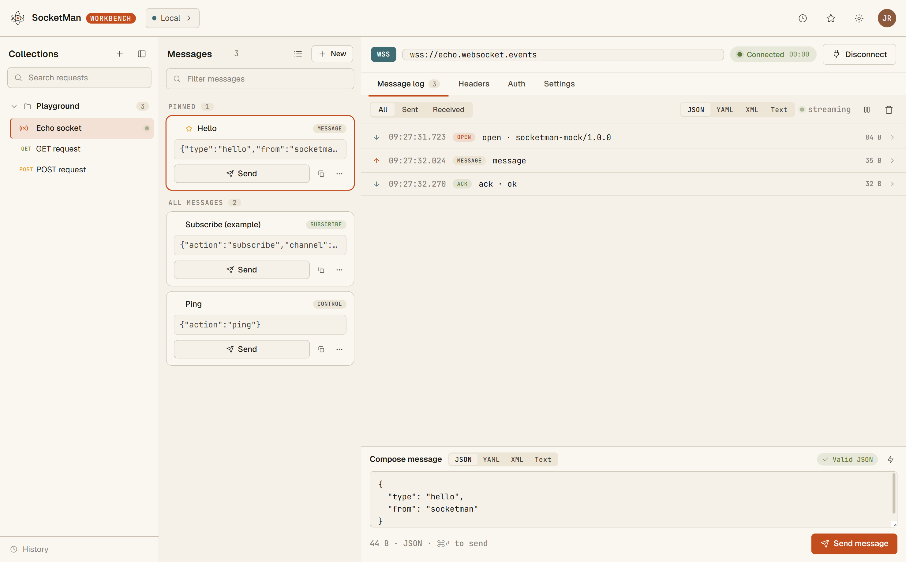
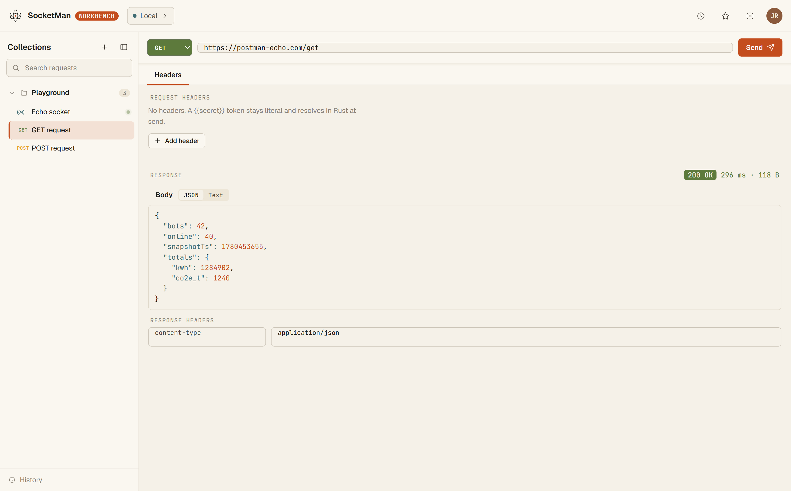

# SocketMan

A desktop **WebSocket + HTTP workbench** built with **Tauri 2** — a React/TypeScript UI over a Rust transport backend. The Rust backend exists for the capabilities a browser can't reach: custom WS upgrade headers, OS-keychain-backed secrets, native-roots TLS, and a strict HTTP client.

> Status: v0.1.0 — Windows-first. MSI + NSIS installers build green. 57 Rust tests, 38 Vitest tests, plus a WebDriver e2e harness over real WebView2.

## Screenshots

**WebSocket workspace** — live session with custom upgrade headers, a pinned message library, and a streaming frame log (sent / received / system frames with timing and byte sizes).



**HTTP workspace** — strict `reqwest` client with status, timing, byte size, pretty-printed JSON body, and response headers. `{{secret}}` tokens stay literal in the editor and resolve Rust-side at send time.



## Features

- **Live WebSocket sessions** — `tokio-tungstenite` engine with custom upgrade headers, auto-reconnect (capped exponential backoff + jitter), explicit-pong heartbeat with dead-socket detection + RTT, and instant user-initiated cancel.
- **HTTP client** — `reqwest` with `rustls` + platform cert verification, status/headers/body/timing, 16 MiB body cap, URL-stripped error messages.
- **Keychain-backed secrets** — secrets live in the OS keychain (`keyring` 3). Only secret *keys* cross to Rust; values are resolved Rust-side on the outbound path. There is no `secret_get` command — the webview can never read secrets back.
- **Atomic JSON persistence** — collections, environments, and history persisted via an atomic JSON store (unique-tmp + fsync + rename, corrupt-tolerant load).
- **Format system** — JSON (gated lossless), plus view-only YAML/XML.
- **Per-connection TLS toggle** — native-roots strict by default; opt-in insecure mode (warned) for self-signed endpoints.
- **History panel** — template-form request/connection history (secrets never logged).

## Tech Stack

| Layer | Tech |
|-------|------|
| Shell | Tauri 2 |
| Frontend | React 18 + TypeScript, Vite 6, Vitest |
| Backend | Rust — `tokio-tungstenite`, `reqwest` (rustls), `keyring` 3 |
| Packaging | NSIS + MSI (Windows, current-user install) |

## Prerequisites

- **Node.js** + npm
- **Rust** toolchain (stable)
- **Tauri 2 system prerequisites** — see [tauri.app prerequisites](https://tauri.app/start/prerequisites/) (on Windows: WebView2 + MSVC build tools)

## Getting Started

```bash
# Install frontend dependencies
npm install

# Run the full Tauri app (Rust backend + webview)
npm run tauri dev

# Or run the frontend alone in the browser (uses the mock transport)
npm run dev
```

When running outside the Tauri webview (browser / Vitest), the app automatically falls back to an in-process **mock transport** that simulates WS + HTTP.

## Scripts

| Command | Description |
|---------|-------------|
| `npm run dev` | Vite dev server (frontend only, mock transport) |
| `npm run tauri dev` | Full Tauri app in dev mode |
| `npm run build` | Type-check (`tsc`), CSP gate, then `vite build` |
| `npm run tauri build` | Build the desktop app + installers (MSI / NSIS) |
| `npm test` | Run Vitest suite |
| `npm run check:csp` | Assert production CSP has no `unsafe-eval` in `script-src` |
| `npm run e2e` | WebDriver e2e over real WebView2 against a hermetic echo server |

## Architecture

```
src/                  React/TypeScript frontend
  transport/          Transport seam — tauri (real) vs mock, runtime-selected
  hooks/              use-workspace-store (coordinator) + thin feature hooks
  lib/                secret-skipping env resolution, secret-refs, history-log
  components/         WS + HTTP workspaces, sidebar, library, env editor, tweaks
  formats/            JSON (lossless) + view-only YAML/XML
src-tauri/            Rust backend
  src/ws/             single-task select! connection loop, reconnect, heartbeat, tls
  src/http/           strict reqwest client (rustls)
  src/storage/        atomic JSON store, keyring secrets (private get), resolve, history
  src/commands.rs     thin IPC handlers + Rust-side secret resolution
e2e/                  WebDriver harness + hermetic local echo server
docs/                 codebase summary, system architecture, deployment guide
```

### The transport seam

The frontend talks to a single `Transport` interface. At runtime, `src/transport/index.ts` selects the real `tauriTransport` (when the Tauri webview is present) or the `mockTransport` (browser / tests). The IPC contract is mirrored between TypeScript and Rust:

```ts
interface Transport {
  wsConnect(cfg, onFrame, onStatus, secrets?): Promise<connId>;
  wsSend(connId, payload, secrets?): Promise<void>;
  wsDisconnect(connId): Promise<void>;
  httpSend(req, secrets?): Promise<HttpResponse>;
  storageLoad(name): Promise<unknown>;
  storageSave(name, data): Promise<void>;
  secretSet(envId, key, value): Promise<void>;   // no secretGet by design
  secretDelete(envId, key): Promise<void>;
  historyAppend(entry): Promise<void>;
}
```

> ⚠️ Keep `@tauri-apps/api` (JS) in sync with the Rust `tauri` crate version — a version skew silently breaks `ipc::Channel` streaming. The e2e harness exists partly to catch this.

## Security Model

1. Secrets stay Rust-private — only keys cross to Rust; values resolved Rust-side at send time.
2. No `secret_get` command — keychain reads are Rust-internal only.
3. Logs keep templates; resolved secrets (including URL secrets) are never logged and are scrubbed from error strings.
4. Tight CSP (`script-src 'self'`, no `unsafe-eval`/`unsafe-inline`), enforced by the build gate.
5. The IPC surface is an explicit allowlist of 9 commands.

## Testing

- **Frontend (Vitest):** format round-trip, secret-skipping env resolution, `use-http`, `use-history`, `secret-refs`, app-boot smoke.
- **Rust:** WS upgrade headers / echo / status flow / reconnect / queued-send-survives-swap / secret redaction / `wss://` TLS proof; HTTP echo + error mapping; storage E2E + real keychain round-trip.
- **E2E:** `tauri-driver` over real WebView2 drives the built release app against a hermetic local echo server — the only layer that catches JS↔Rust IPC protocol skew.

## Limitations (v1)

- **Platform:** Windows-first (keyring uses `windows-native`; NSIS/MSI packaging). macOS/Linux deferred.
- **Protocols:** WS + HTTP only — no SSE/Socket.IO/MQTT; text WS frames only (no binary).
- **No Postman import** — own JSON format.
- **TLS:** native-roots strict by default with an opt-in per-connection insecure toggle; no cert pinning.
- **YAML/XML:** best-effort view-only; JSON is the lossless path.

## Documentation

- `docs/codebase-summary.md` — full module-by-module breakdown
- `docs/system-architecture.md` — architecture detail
- `docs/deployment-guide.md` — packaging & release

## License

Copyright © 2026 SocketMan.
